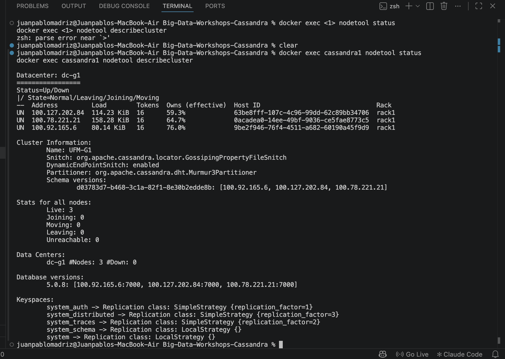
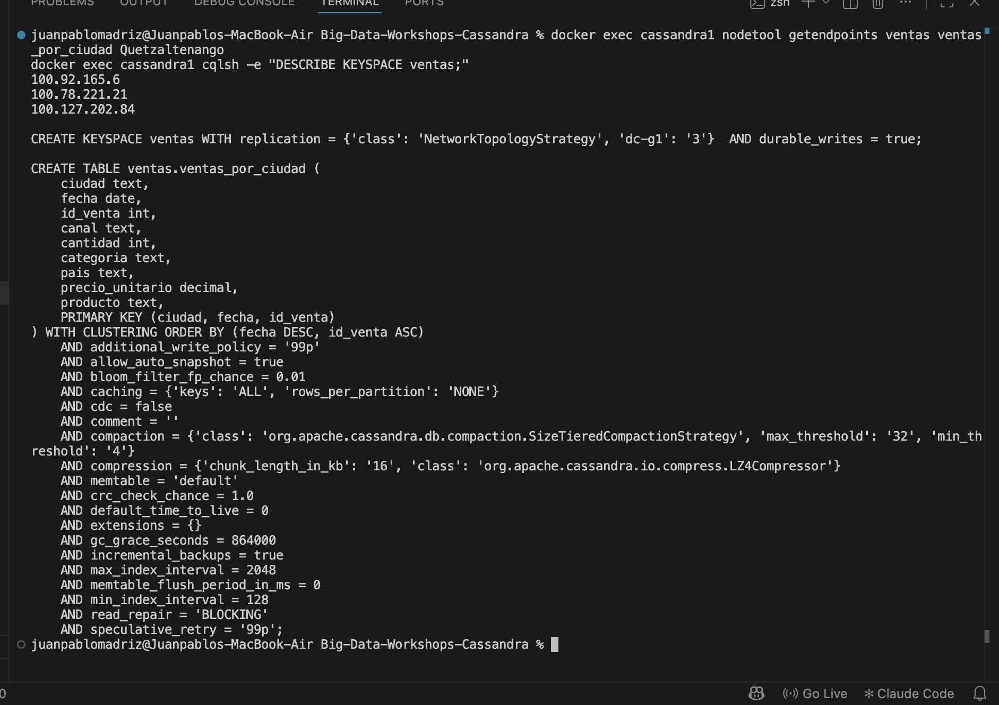
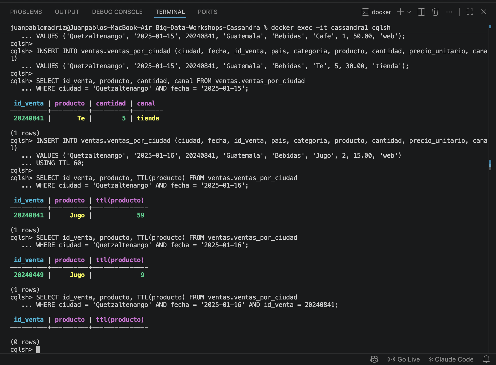
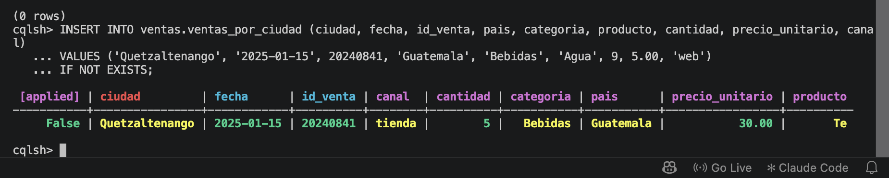
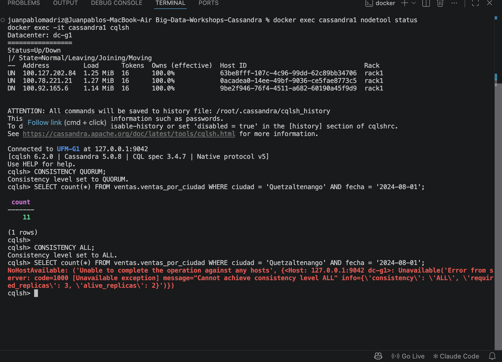
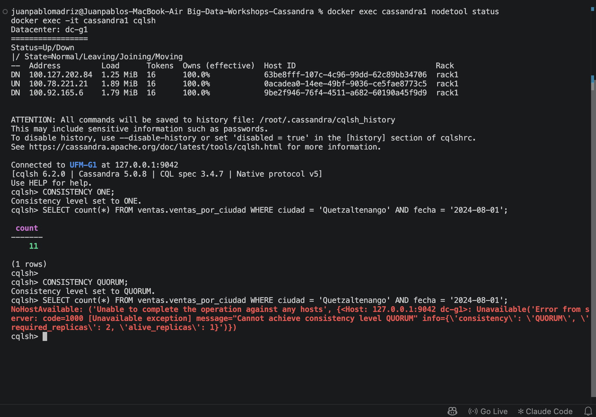
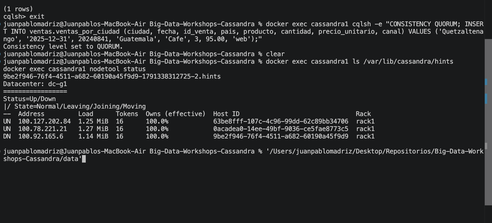
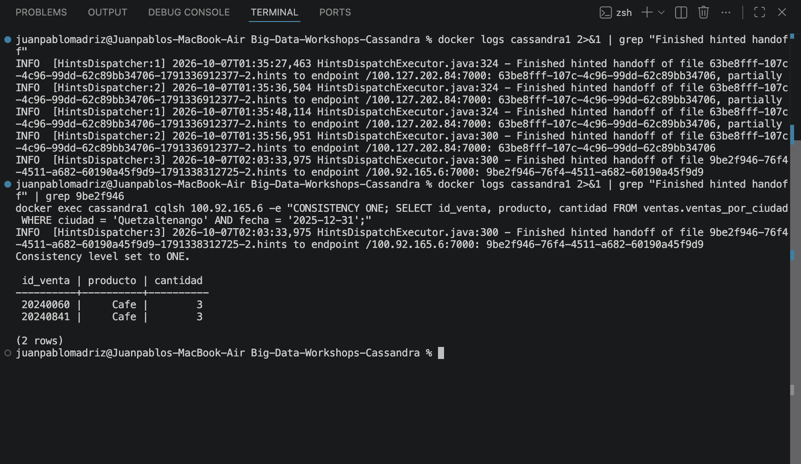

# Bitácora del taller de Cassandra

- **Nombre:** Juan Pablo Madriz
- **Carné:** 20240841
- **Grupo:** G1
- **Tu nodo en el clúster del grupo:** `cassandra1` (nodo semilla), IP de Tailscale `100.78.221.21`

---

## 1. Evidencias

### E1. Tres nodos en tu clúster y tu datacenter

`nodetool status` muestra los tres nodos en `UN` dentro de `Datacenter: dc-g1`, con las IP de
Tailscale de las tres laptops: `100.127.202.84`, `100.78.221.21` (la mía) y `100.92.165.6`, cada una
con 16 tokens. Abajo, `nodetool describecluster` confirma `Name: UFM-G1`, `Live: 3` y
`dc-g1 #Nodes: 3 #Down: 0`.

### E2. Las copias de la partición de Quetzaltenango

`nodetool getendpoints ventas ventas_por_ciudad Quetzaltenango` devuelve tres direcciones,
`100.92.165.6`, `100.78.221.21` y `100.127.202.84`: con RF 3 y tres nodos, la partición vive en
todos. El `DESCRIBE KEYSPACE ventas` de abajo muestra
`replication = {'class': 'NetworkTopologyStrategy', 'dc-g1': '3'}`.

### E3a. Upsert y TTL

Los dos `INSERT` usan la misma llave primaria (`Quetzaltenango`, `2025-01-15`, `20240841`) y el
`SELECT` devuelve **una sola fila**, con los valores del segundo: `Te | 5 | tienda`. Después inserté
la fila del `2025-01-16` con `USING TTL 60`: el primer `SELECT` la muestra con `ttl(producto) = 59`
y el último, ya filtrando por `id_venta = 20240841`, devuelve `(0 rows)` porque ya expiró.

### E3b. IF NOT EXISTS

El `INSERT ... IF NOT EXISTS` sobre la misma llave del upsert no se aplica: sale `[applied] False` y
la fila que ya estaba (`Quetzaltenango | 2025-01-15 | 20240841 | tienda | 5 | Bebidas | Guatemala |
30.00 | Te`). La LWT no pisó nada.

### E4. Un nodo caído: QUORUM frente a ALL

`nodetool status` muestra `100.92.165.6` en `DN` (Host ID `9be2f946-76f4-4511-a682-60190a45f9d9`) y
los otros dos en `UN`. Con `CONSISTENCY QUORUM` la lectura responde `count = 11`, y la misma lectura
con `CONSISTENCY ALL` se rechaza: `Cannot achieve consistency level ALL`, con
`required_replicas: 3, alive_replicas: 2`.

### E5. Dos nodos caídos: ONE frente a QUORUM

Ahora `100.127.202.84` y `100.92.165.6` salen en `DN` y solo queda `UN` mi nodo, `100.78.221.21`.
Con `CONSISTENCY ONE` la lectura todavía responde `count = 11`, y con `CONSISTENCY QUORUM` se
rechaza: `Cannot achieve consistency level QUORUM`, con `required_replicas: 2, alive_replicas: 1`.

### E6a. El hint guardado para el nodo caído

Arriba está el `INSERT` de mi venta con `CONSISTENCY QUORUM` y `id_venta = 20240841`. Después,
`ls /var/lib/cassandra/hints` muestra el archivo
`9be2f946-76f4-4511-a682-60190a45f9d9-1791338312725-2.hints`, y el `nodetool status` de abajo tiene a
`100.92.165.6` en `DN` con ese mismo Host ID: el hint es para ese nodo.

### E6b. La entrega del hint

El `grep` saca la línea `INFO [HintsDispatcher:3] 2026-10-07T02:03:33,975
HintsDispatchExecutor.java:300 - Finished hinted handoff of file
9be2f946-76f4-4511-a682-60190a45f9d9-1791338312725-2.hints to endpoint /100.92.165.6:7000`. Abajo leo
con `CONSISTENCY ONE` apuntando `cqlsh` a `100.92.165.6` y ahí está mi venta, `20240841 | Cafe | 3`
(la otra fila, `20240060`, es de un compañero).

### Tabla del Paso 8

| Nodos caídos | `ONE` | `QUORUM` | `ALL` |
|---|---|---|---|
| 0 | ✅ | ✅ | ✅ |
| 1 | ✅ | ✅ | ❌ |
| 2 | ✅ | ❌ | ❌ |

---

## 2. Preguntas

**1. ¿Qué línea de la traza muestra que la consulta por ciudad leyó una sola partición, y cuál que la de producto recorrió toda la tabla? ¿Por qué Cassandra rechaza la segunda sin ALLOW FILTERING?**

En la consulta por ciudad la línea es `Executing single-partition query on ventas_por_ciudad
[ReadStage-15]`, y justo abajo `Read 11 live rows and 0 tombstone cells`: una sola partición, la de
Quetzaltenango, y de ahí salieron las 11 filas del 2024-08-01.
En la de producto la línea es `Submitting range requests on 49 ranges with a concurrency of 1
(38220.0 rows per range expected)`, seguida de `Executing seq scan across 3 sstables for
(min(-9223372036854775808), min(-9223372036854775808)]`. Ese par se repite 50 veces en mi traza hasta
leer 75,006 filas para devolver `count = 4911`.
Sin `ALLOW FILTERING` la rechaza porque `producto` no es parte de la llave primaria: Cassandra no le
puede sacar el token y no sabe en qué nodo está, así que tendría que recorrer el anillo completo.
Prefiere botar `InvalidRequest ... unpredictable performance` antes que correr algo cuyo costo crece
con el tamaño de la tabla.

**2. ¿Qué lecturas se comportaron como CP y cuáles como AP? ¿Qué nivel usarías para el saldo de una cuenta y cuál para un contador de reproducciones, y por qué?**

Según mi tabla, `ALL` y `QUORUM` se portaron como CP y `ONE` como AP. Con un nodo caído `QUORUM`
devolvió `11` pero `ALL` se rechazó con `required_replicas: 3, alive_replicas: 2`: prefirió fallar
antes que contestar con dos copias. Con dos caídos `QUORUM` también se cayó
(`required_replicas: 2, alive_replicas: 1`) y solo `ONE` siguió respondiendo `11` con una sola
réplica viva, que es justo el comportamiento AP: contesta aunque falten copias.
Para el saldo de una cuenta usaría `QUORUM`: si no hay mayoría prefiero que la app tire error a que
enseñe un saldo viejo. Para un contador de reproducciones usaría `ONE`: que vaya diez
reproducciones atrás no le molesta a nadie, pero que la página no cargue sí.

**3. ¿Cómo se enteró el nodo apagado de tu venta? ¿Qué pasaría si el nodo estuviera apagado más tiempo que max_hint_window?**

Mientras `100.92.165.6` estaba `DN`, escribí la venta con `QUORUM` desde mi nodo. Mi nodo fue el
coordinador: la guardó en las dos réplicas vivas y le dejó un hint al apagado. En E6a se ve el
archivo `9be2f946-76f4-4511-a682-60190a45f9d9-1791338312725-2.hints`: lleva el Host ID del nodo
apagado en el nombre.
Cuando el nodo volvió, mi nodo se lo entregó. La línea del log es `INFO [HintsDispatcher:3]
2026-10-07T02:03:33,975 HintsDispatchExecutor.java:300 - Finished hinted handoff of file
9be2f946-76f4-4511-a682-60190a45f9d9-1791338312725-2.hints to endpoint /100.92.165.6:7000`. Después
leí desde esa IP con `ONE` y ahí estaba mi venta.
Si hubiera estado apagado más que `max_hint_window` (3 horas por defecto), el coordinador deja de
guardarle hints y bota los que ya tenía. El dato le llegaría hasta un `nodetool repair`, o por read
repair cuando alguien leyera esa partición con un nivel que lo obligue a comparar con las otras
copias.

---

## 3. Mini-reto

### Tablas

| Tabla | Consulta que responde | Partition key | Clustering key |
|---|---|---|---|
| `usuarios_por_id` | C1 | `(usuario_id)` | — |
| `reproducciones_por_usuario` | C2 | `(usuario_id)` | `reproducida_en DESC, reproduccion_id ASC` |
| `canciones_por_playlist` | C3 | `(playlist_id)` | `posicion ASC, cancion_id ASC` |
| `reproducciones_por_cancion_dia` | C4 | `(cancion_id, dia)` | `reproducida_en ASC, reproduccion_id ASC` |

### Justificación

**Por qué esas llaves:**

Saqué cada tabla de su consulta: lo que el `WHERE` filtra quedó de partition key y lo que el
`ORDER BY` ordena quedó de clustering key. Por eso `usuarios_por_id` solo lleva `usuario_id`, y
`reproducciones_por_usuario` parte por `usuario_id` con `reproducida_en DESC`, para que el `LIMIT 10`
se lleve las diez primeras filas de la partición sin ordenar nada en memoria.
`canciones_por_playlist` parte por `playlist_id` y ordena por `posicion ASC`, el mismo orden del SQL.
En `reproducciones_por_cancion_dia` el rango de fechas es un día exacto, así que metí el día en la
partition key junto al `cancion_id`: el `COUNT` lee una sola partición, y de paso la partición de una
canción muy escuchada no crece sin límite. Los `reproduccion_id` y `cancion_id` al final de las
clustering keys son solo para que no se pierdan filas por upsert.

**Qué datos quedaron duplicados entre tablas:**

`titulo` y `artista` vienen de la tabla `canciones`, que en el SQL se alcanza con un `JOIN`. Como
Cassandra no tiene `JOIN` los copié dentro de `reproducciones_por_usuario` y de
`canciones_por_playlist`, así que la misma canción queda escrita una vez por cada reproducción y una
por cada playlist donde aparece. Las 5,000 reproducciones también quedaron guardadas dos veces, en
`reproducciones_por_usuario` y en `reproducciones_por_cancion_dia`, porque una consulta las busca por
usuario y la otra por canción y día. En total cargué 10,926 filas para las 6,286 que traen los cinco
CSV. El `pais` y el `plan` no los dupliqué porque ninguna otra consulta los pide.

**Qué hace la aplicación si cambia un dato duplicado:**

Cassandra no tiene llaves foráneas ni `UPDATE` en cascada, así que le toca a la aplicación. Si se
corrige el título de una canción hay que reescribirlo en `canciones_por_playlist` para cada playlist
donde está y en `reproducciones_por_usuario` para cada reproducción de esa canción. Lo difícil es
encontrar esas filas: en ninguna de las dos el `cancion_id` es partition key, así que buscarlo ahí
pediría `ALLOW FILTERING`. Haría falta otra tabla índice, tipo `playlists_por_cancion`, que diga en
qué particiones entrar. Y aun así no queda atómico: mientras va escribiendo, unas tablas ya traen el
título nuevo y otras todavía el viejo. Por eso duplico solo lo que casi no cambia y no cosas como el
`plan` del usuario.

---

## 4. Problemas encontrados

- El puerto 7000 estaba ocupado por el Receptor de AirPlay de macOS y `docker compose up` fallaba con
  `port is already allocated`. Lo desactivé en Ajustes del Sistema y `lsof -nP -iTCP:7000
  -sTCP:LISTEN` dejó de devolver nada.
- El hotspot del teléfono no sirvió. Las laptops se hacían ping bien, pero su subred
  `172.20.10.0/28` cae dentro del `172.20.0.0/16` que Docker reparte a sus redes, y el contenedor
  daba `No route to host`. Nos pasamos a Tailscale, que usa `100.64.0.0/10`. La latencia entre nodos
  quedó entre 200 y 500 ms.
- Al primer intento salió `Saved cluster name Test Cluster != configured name UFM-G1`: el volumen
  todavía tenía los datos de la Parte 1. Se arregló con `docker compose down -v` antes de levantar
  el nodo.
- En `carga.py` puse primero `TIMEFORMAT` y cqlsh contestó `Unrecognized COPY FROM options:
  timeformat`. La opción buena para `COPY FROM` es `DATETIMEFORMAT`; con `'%Y-%m-%d %H:%M:%S%z'` y
  los timestamps escritos con `+0000` las horas entraron en UTC, igual que en los CSV.
- Por la latencia le dejé a la carga tres reintentos por tabla, `MAXATTEMPTS = 5` dentro del `COPY` y
  `--request-timeout=120` en cqlsh. Ninguna se me cayó por timeout, pero lo dejé así porque la carga
  es idempotente y se puede repetir sin duplicar nada.
